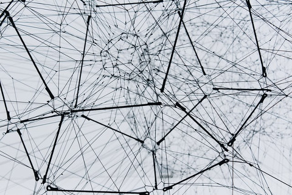

Hi and welcome to this blog!

Below you will find a list of blog posts: I will share my **learnings in the field of "Deep Learning"** on this blog. I hope you will find it interesting.
I`m going through the the fast.ai course currently, called: [Practical Deep Learning for Coders](https://www.fast.ai/).
Some blog posts may be examples or exercises from the course.

If you find this blog interesting and you would like to get in touch, feel free to come and say hello on Twitter! (handle at the bottom of the page)

